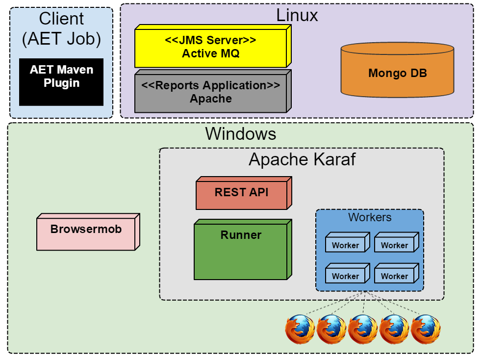

## Environment Setup

There are two ways to setup AET environment: basic and advanced.

##### basic

Basic setup uses [Vagrant](https://www.vagrantup.com/) to create a single virtual machine running Linux OS (currently CentOS 6.7). This virtual machine contains all AET services as well as all required software. In this configuration, tests are using Linux version of Firefox web browser. Please note that there are differences in web pages rendering between Linux and Windows versions of Firefox and if you want to use Windows then you must use advanced setup.

See **[[Basic Setup|BasicSetup]]** for more details.

Diagram below shows basic AET setup.

##### advanced

Advanced setup on the other hand consists of two machines - one with Linux OS and one with Windows, both complementary to each other. Linux machine hosts services such as MongoDB, and ActiveMQ whereas Windows machine hosts Karaf, Browsermob proxy and Firefox. In this configuration, tests are using Windows version of Firefox web browser.

See **[[Linux and Windows Setup|LinuxAndWindowsSetup]]** for more details.

Diagram below shows advanced AET setup.

