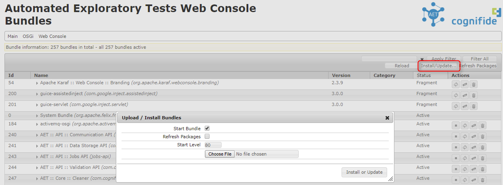
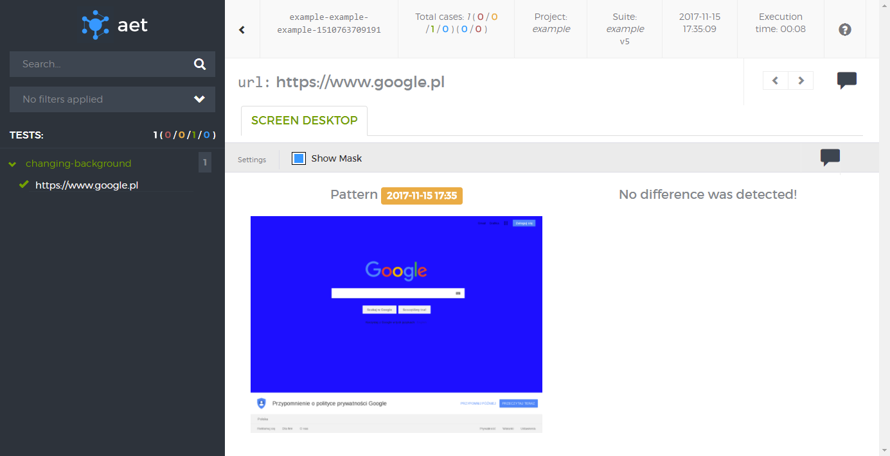

## How to extend AET

AET comes with many useful [[Features|Features]]. However, the tool doesn't solve all the challenges.
And because of that AET are very easy to extend. You may create your own module, deploy it on your AET instance
and start using it (no system restarts are required!).
There are 4 types of modules in AET:
* [[Collectors|Collectors]]
* [[Modifiers|Modifiers]]
* [[Comparators|Comparators]]
* [[Data Filters|DataFilters]]

You may extend AET with any of those types. To do so, you need to implement several interfaces from 
[`jobs-api`](https://github.com/Cognifide/aet/tree/master/api/jobs-api) module.
Below we present how to create a custom Modifier, which is the most common case and is the easiest type to extend.
Extending other types is similar and examples will be available in the future, however creating a new type of
[[Collector|Collectors]] and corresponding [[Comparator|Comparators]] involves also 
extending [[Report Application|SuiteReport]] to present the results.

#### What do you need to create your own AET Modifier
Creating a new AET Modifier is really easy. You need basic Java and OSGi knowledge and installed JDK.
We are also working on maven archetypes for each of those types that will help you to create extension structure.

### How to create a sample AET Modifier
In this example we will use [Maven](https://maven.apache.org/) to build this project and create OSGi bundle, 
however you can use any other build tool that you find useful.

Now, we will create a sample Modifier that enables to change the background color of the tested page.
The idea here is to use a Modifier in the [[`<collect>`|TestProcessing#collection]] 
phase and select the color of the background that will be applied to the page. Sample usage can look like this:

```<change-background color="blue" />```

And this will change the background of the page to `blue`.

#### 1. Setup project structure
Prepare project structure:
```
src
|- main
   |-java
pom.xml
```

Example `pom.xml` is presented below. It already contains all necessary dependencies that will be used
in this example Modifier. Remember, that we are working with OSGi so all the dependencies you need should
be available on the Karaf instance that AET are running at.

```xml
<?xml version="1.0" encoding="UTF-8"?>
<project xmlns="http://maven.apache.org/POM/4.0.0"
    xmlns:xsi="http://www.w3.org/2001/XMLSchema-instance"
    xsi:schemaLocation="http://maven.apache.org/POM/4.0.0 http://maven.apache.org/xsd/maven-4.0.0.xsd">
    <modelVersion>4.0.0</modelVersion>

    <groupId>com.example.aet.modifiers.pagebackground</groupId>
    <artifactId>page-background-modifier</artifactId>
    <version>1.0-SNAPSHOT</version>
    <packaging>bundle</packaging>

    <name>AET Background Modifier</name>
    <description>AET Modifier That Changes Page Background Color</description>

    <properties>
        <maven.compiler.compilerVersion>1.7</maven.compiler.compilerVersion>
        <maven.compiler.fork>true</maven.compiler.fork>
        <project.build.sourceEncoding>UTF-8</project.build.sourceEncoding>
        <!-- this should be versions of AET and libraries that you have deployed on Karaf -->
        <aet.api.version>2.1.2</aet.api.version>
        <slf4j.version>1.7.5</slf4j.version>
        <selenium.version>2.50.1</selenium.version>
        <felix.version>1.9.6</felix.version>
    </properties>

    <dependencies>
        <!-- AET API -->
        <dependency>
            <groupId>com.cognifide.aet</groupId>
            <artifactId>communication-api</artifactId>
            <version>${aet.api.version}</version>
        </dependency>
        <dependency>
            <groupId>com.cognifide.aet</groupId>
            <artifactId>jobs-api</artifactId>
            <version>${aet.api.version}</version>
        </dependency>
        <dependency>
            <groupId>com.cognifide.aet</groupId>
            <artifactId>datastorage-api</artifactId>
            <version>${aet.api.version}</version>
        </dependency>

        <dependency>
            <groupId>org.slf4j</groupId>
            <artifactId>slf4j-api</artifactId>
            <version>${slf4j.version}</version>
        </dependency>
        <dependency>
            <groupId>org.slf4j</groupId>
            <artifactId>slf4j-simple</artifactId>
            <version>${slf4j.version}</version>
        </dependency>

        <dependency>
            <groupId>org.apache.felix</groupId>
            <artifactId>org.apache.felix.scr.annotations</artifactId>
            <version>${felix.version}</version>
        </dependency>

        <dependency>
            <groupId>org.seleniumhq.selenium</groupId>
            <artifactId>selenium-api</artifactId>
            <version>${selenium.version}</version>
        </dependency>
    </dependencies>

    <build>
        <plugins>
            <plugin>
                <groupId>org.apache.felix</groupId>
                <artifactId>maven-bundle-plugin</artifactId>
            </plugin>
        </plugins>

        <pluginManagement>
            <plugins>
                <plugin>
                    <groupId>org.apache.maven.plugins</groupId>
                    <artifactId>maven-compiler-plugin</artifactId>
                    <version>3.3</version>
                    <configuration>
                        <source>1.7</source>
                        <target>1.7</target>
                    </configuration>
                </plugin>

                <plugin>
                    <groupId>org.apache.felix</groupId>
                    <artifactId>maven-bundle-plugin</artifactId>
                    <version>2.4.0</version>
                    <extensions>true</extensions>
                </plugin>

                <plugin>
                    <groupId>org.apache.felix</groupId>
                    <artifactId>maven-scr-plugin</artifactId>
                    <version>1.15.0</version>
                    <executions>
                        <execution>
                            <id>generate-scr-scrdescriptor</id>
                            <goals>
                                <goal>scr</goal>
                            </goals>
                        </execution>
                    </executions>
                </plugin>
            </plugins>
        </pluginManagement>
    </build>
</project>
```

#### 2. Implement Modifier interface
Start with creating `PageBackgroundModifier` class in the `com.example.aet.modifiers.pagebackground` package.
Now, implement a [`CollectorJob`](https://github.com/Cognifide/aet/blob/master/api/jobs-api/src/main/java/com/cognifide/aet/job/api/collector/CollectorJob.java).
This is common interface for both [[Collectors|Collectors]] and [[Modifiers|Modifiers]].
You will have to implement two methods:
- `collect` which is executed during the [[`collection phase`|TestProcessing#collection]], this method can throw 
 [`ProcessingException`](https://github.com/Cognifide/aet/blob/master/api/jobs-api/src/main/java/com/cognifide/aet/job/api/exceptions/ProcessingException.java)
 when the modification fails. Throwing this exception from the `collect` method won't terminate processing of all collectors/modifiers. The 
 idea here is to continue processing other steps despite this error (and this is the expected behavior). 
 If you want to terminate processing you should throw an exception that doesn't inherit 
 from [`AETException`](https://github.com/Cognifide/aet/blob/master/api/communication-api/src/main/java/com/cognifide/aet/communication/api/exceptions/AETException.java).
- `setParameters` that setups all parameters necessary to perform modification (in our case `color` parameter), 
this method can throw [`ParametersException`](https://github.com/Cognifide/aet/blob/master/api/jobs-api/src/main/java/com/cognifide/aet/job/api/exceptions/ParametersException.java)
when some mandatory parameter is missing. Throwing this exception will terminate processing of all collectors/modifiers steps.

Implementation of `PageBackgroundModifier` can look like this:

```java
package com.example.aet.modifiers.pagebackground;

import com.cognifide.aet.communication.api.metadata.CollectorStepResult;
import com.cognifide.aet.job.api.collector.CollectorJob;
import com.cognifide.aet.job.api.exceptions.ParametersException;
import com.cognifide.aet.job.api.exceptions.ProcessingException;
import java.util.Map;
import org.openqa.selenium.JavascriptExecutor;
import org.openqa.selenium.WebDriver;
import org.slf4j.Logger;
import org.slf4j.LoggerFactory;

public class PageBackgroundModifier implements CollectorJob {

  private static final Logger LOGGER = LoggerFactory.getLogger(PageBackgroundModifier.class);

  static final String NAME = "change-background";

  private static final String COLOR_PARAM = "color";
  private static final String EXAMPLE_CHANGE_BACKGROUND_MODIFICATION = "document.body.style.background = '%s';";

  private final WebDriver webDriver;
  private String color;

  PageBackgroundModifier(WebDriver webDriver) {
    this.webDriver = webDriver;
  }

  @Override
  public CollectorStepResult collect() throws ProcessingException {
    CollectorStepResult result;
    try {
      final String command = String.format(EXAMPLE_CHANGE_BACKGROUND_MODIFICATION, color);
      ((JavascriptExecutor) webDriver).executeScript(command);
      result = CollectorStepResult.newModifierResult();
    } catch (Exception e) {
      final String message = String
          .format("Can't execute JavaScript command. Error: %s ", e.getMessage());
      result = CollectorStepResult.newProcessingErrorResult(message);
      LOGGER.warn(message, e);
    }
    return result;
  }

  @Override
  public void setParameters(Map<String, String> params) throws ParametersException {
    if (!params.containsKey(COLOR_PARAM)) {
      throw new ParametersException(
          "'color' parameter must be provided for element modifier.");
    }
    color = params.get(COLOR_PARAM);
  }
}
```
#### 3. Implement CollectorFactory interface to register new Modifier
The next step is to register new Modifier in the AET system. To do so, you need to implement a
[`CollectorFactory`](https://github.com/Cognifide/aet/blob/master/api/jobs-api/src/main/java/com/cognifide/aet/job/api/collector/CollectorFactory.java)
and make it an OSGi Service.
You will need to implement two methods:
- `getName` that will return the name of registered Modifier (this is the name that will be used in suite XML to call the Modifier) in our case it is `"change-background"`,
- `createInstance` that will create a new instance of Modifier.

Implementation of `PageBackgroundModifierCollectorFactory` can look like this:

```java
package com.example.aet.modifiers.pagebackground;

import com.cognifide.aet.job.api.collector.CollectorFactory;
import com.cognifide.aet.job.api.collector.CollectorJob;
import com.cognifide.aet.job.api.collector.CollectorProperties;
import com.cognifide.aet.job.api.collector.WebCommunicationWrapper;
import com.cognifide.aet.job.api.exceptions.ParametersException;
import java.util.Map;
import org.apache.felix.scr.annotations.Component;
import org.apache.felix.scr.annotations.Service;

@Component
@Service
public class PageBackgroundModifierCollectorFactory implements CollectorFactory {

  @Override
  public String getName() {
    return PageBackgroundModifier.NAME;
  }

  @Override
  public CollectorJob createInstance(CollectorProperties properties, Map<String, String> parameters,
      WebCommunicationWrapper webCommunicationWrapper) throws ParametersException {
    PageBackgroundModifier modifier = new PageBackgroundModifier(webCommunicationWrapper.getWebDriver());
    modifier.setParameters(parameters);
    return modifier;
  }
}
```

#### 4. Build and deploy Modifier
Coding is finished now. You can build the Modifier into a bundle using Maven command:

`mvn package`

And you should have `target` directory created with `page-background-modifier-1.0-SNAPSHOT.jar` bundle.

Open OSGi console and install the bundle using `Install/Update...` button (remember to install it on 
every worker if your environment contains more than one Karaf instance) like this:



You should see now that your bundle is `Active`:


#### 5. Run AET Suite that uses new Modifier
The only thing left now is to check how the new Modifier works!
Create a [[Suite XML file|DefiningSuite]] and [[run it|RunningSuite]].

Sample suite could look like this:
```xml
<?xml version="1.0" encoding="UTF-8"?>
<suite name="example" company="example" project="example">
	<test name="changing-background">
		<collect>
			<open/>
			<wait-for-page-loaded />
			<sleep duration="1000"/>
			
			<change-background color="blue" />
			
			<resolution width="1280" height="1024"/>
			<sleep duration="2000"/>
			<screen  name="desktop"/>
		</collect>
		<compare>
			<screen comparator="layout"/>
		</compare>
		<urls>
			<url href="https://www.google.pl"/>
		</urls>
	</test>
</suite>
```

And the report you will see after the run is finished shows a page with changed background:


Job done!