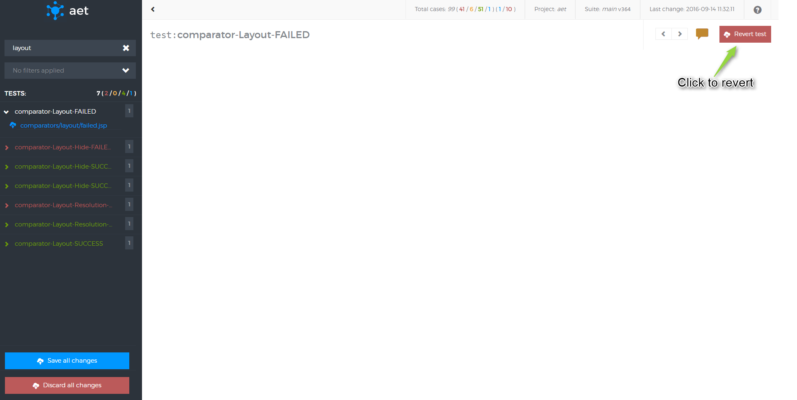
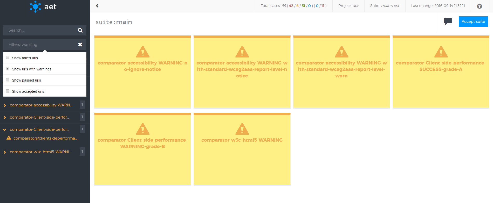
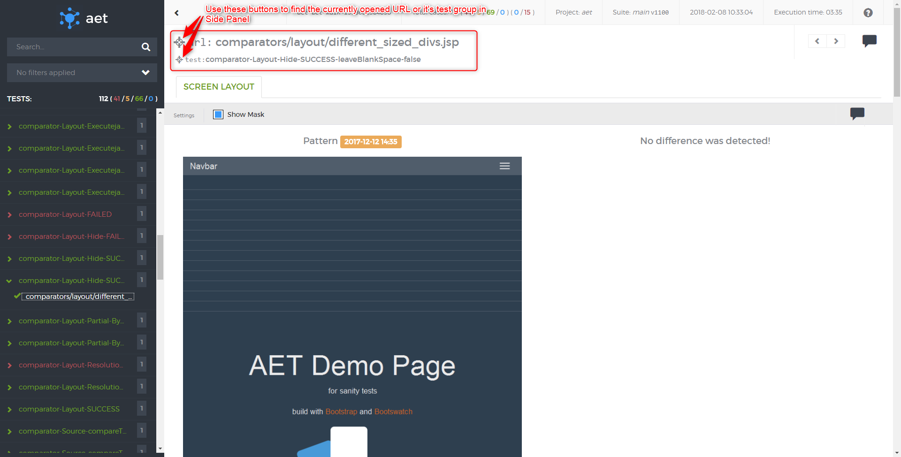

### Features
#### Accepting/reverting patterns
There is possibility to accept failed test on each level (suite, test and URL) for the test cases in which the pattern is used (for now acceptable cases are: cookie compare, layout for screen and source "Source"). It is possible to revert certain acceptation, but for now only if changes are not saved. Accepting on suite level makes all acceptable test accepted, on test level it provides acceptation of each URL in certain test case. The lowest level is accepting certain URLs.

Accepting pattern example:

Reverting pattern example:

#### Notes creation
There is possibility to add notes to each level of the report. Notes are useful to give some information 
about test case e.g. why failed test was accepted.

#### Filtering test results
Every test case has one of the following states:

1. passed — if the comparator doesn't find any change, i.e. validation passes,
2. passed with warnings — if there are some warnings, but they are not very important,
3. conditionally passed - if the comparator finds some change, but the change is smaller or equal to error threshold
4. failed — if the comparator detects some changes or some validation rules are broken,
5. accepted — if failed test was accepted.

Tests and URLs may be filtered by:

* text included in the test name or URL,
* test status.

Filtering by status works as an alternative: if one selects passed and failed tests both should be visible.

#### Searching for specific test/URL
It is possible to search tests and URLs by the query. Searched fields are the URL and test name.

#### Scrolling Side Panel to currently opened test/URL
It is possible to find currently opened test/URL in Side Panel by using the crosshair buttons. 
Moreover, every URL has information to which test group it belongs.

#### Browsing suite's history
It is possible to view current suite's history by clicking current suite's name and version in the top toolbar. User can also navigate through versions by clicking next/previous arrow next to suite's version. 

Clicking the suite's name in the top toolbar will show a popup in which the user can see every suite's version that is still available in the database. User can also directly go to the newest version of the suite by clicking 

Bold version means that this version is the same as the version that's currently being viewed.
Blue version means that it is a rebased version of previous suite - this is also shown by the timestamps which are identical for original and rebased suite versions.

#### Navigation via keyboard shortcuts
* press **q** to expand/collapse all items
* press **e** to expand/collapse all error items
* use **[** / **]** to navigate between test's urls
* press **m** to show/hide layout mask (when available)
* press **←** / **→** to navigate between url's tabs